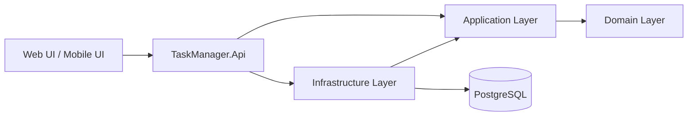

# Task Manager API

API REST para gestión de tareas, construida con **.NET 8** bajo una arquitectura **Hexagonal (Ports & Adapters)** como **Monolito Modular**. Diseñada para escalar hacia un sistema tipo Trello/Jira, con énfasis en principios de diseño limpios, separación de responsabilidades y capacidad de evolución.

---

## Arquitectura



### Proyectos

| Proyecto | Responsabilidad | Dependencias |
|----------|----------------|--------------|
| `TaskManager.Api` | Entrypoint HTTP, controladores, middleware | Application, Infrastructure, Contracts |
| `TaskManager.Application` | Casos de uso, servicios de aplicación, DTOs | Domain |
| `TaskManager.Domain` | Entidades, value objects, enums, eventos de dominio | Ninguna |
| `TaskManager.Infrastructure` | Persistencia EF Core, PostgreSQL, repositorios, JWT | Domain, Application |
| `TaskManager.Contracts` | Contratos públicos de request/response | Ninguna |

### Reglas arquitectónicas

- **Domain** no tiene dependencias externas (sin EF Core, sin ASP.NET, sin paquetes NuGet).
- **Application** nunca referencia a Infrastructure directamente. Se comunica mediante interfaces definidas en `Application/Common/Interfaces/`.
- **Infrastructure** implementa esas interfaces y referencia a Application.
- **Contracts** son DTOs planos; no referencian otros proyectos de la solución.

---

## Stack tecnológico

| Componente | Versión |
|------------|---------|
| .NET SDK | `8.0.421` (`rollForward: latestFeature`) |
| ASP.NET Core | 8.0 |
| Entity Framework Core | `8.0.27` |
| Npgsql (EF Core Provider) | `8.0.11` |
| PostgreSQL | 17 |
| Docker | 24+ (con Docker Compose v2) |

---

## Prerrequisitos

- [.NET SDK 8.0](https://dotnet.microsoft.com/download/dotnet/8.0)
- [Docker Desktop](https://www.docker.com/products/docker-desktop/) (con Docker Compose v2)
- Git

Verificar instalación:

```bash
dotnet --version
docker --version
docker compose version
```

---

## Inicio rápido (desarrollo)

### 1. Clonar el repositorio

```bash
git clone <url-del-repositorio>
cd task-manager-app
```

### 2. Iniciar PostgreSQL

```bash
docker compose -f docker/docker-compose.yml up -d
```

Esto levanta PostgreSQL 17 en `localhost:5432`, base de datos `task_manager`, usuario `postgres`, contraseña `postgres`.

### 3. Aplicar migraciones (opcional, se aplican automáticamente al iniciar)

```bash
dotnet ef database update --project src/TaskManager.Infrastructure --startup-project src/TaskManager.Api
```

### 4. Ejecutar la API

```bash
dotnet run --project src/TaskManager.Api
```

La API se inicia en:
- HTTP: `http://localhost:5225`
- HTTPS: `https://localhost:7000`

### 5. Verificar

```bash
curl http://localhost:5000
# → "Task Manager API running"
```

O abrir `http://localhost:5000` en el navegador.

---

## Comandos disponibles

```bash
# Limpiar la solución completa
dotnet clean

# Restaurar paquetes NuGet (Opcional, se hace automáticamente al compilar)
dotnet restore

# Compilar la solución completa
dotnet build

# Ejecutar la API
dotnet run --project src/TaskManager.Api

# Ejecutar tests (cuando existan)
dotnet test

# Publicar para producción
dotnet publish src/TaskManager.Api/TaskManager.Api.csproj \
    -c Release \
    -o ./publish

# Crear una migración de EF Core
dotnet ef migrations add <NombreMigracion> \
    --project src/TaskManager.Infrastructure \
    --startup-project src/TaskManager.Api

# Aplicar migraciones a la BD
dotnet ef database update \
    --project src/TaskManager.Infrastructure \
    --startup-project src/TaskManager.Api

# Iniciar PostgreSQL
docker compose -f docker/docker-compose.yml up -d

# Detener PostgreSQL
docker compose -f docker/docker-compose.yml down

# Ver logs de PostgreSQL
docker compose -f docker/docker-compose.yml logs -f
```

---

## Endpoints disponibles

### Permissions (`/api/permissions`)

| Método | Ruta | Descripción |
|--------|------|-------------|
| `POST` | `/api/permissions` | Crear un permiso |
| `GET` | `/api/permissions` | Listar todos los permisos activos |
| `GET` | `/api/permissions/{id:guid}` | Obtener permiso por ID |
| `PUT` | `/api/permissions/{id:guid}` | Actualizar permiso |
| `DELETE` | `/api/permissions/{id:guid}` | Eliminación lógica de permiso |

```bash
curl -X POST http://localhost:5000/api/permissions \
  -H "Content-Type: application/json" \
  -d '{"name": "task:create", "description": "Crear tareas"}'
```

### Roles (`/api/roles`)

| Método | Ruta | Descripción |
|--------|------|-------------|
| `POST` | `/api/roles` | Crear un rol |
| `GET` | `/api/roles` | Listar todos los roles activos |
| `GET` | `/api/roles/{id:guid}` | Obtener rol por ID |
| `PUT` | `/api/roles/{id:guid}` | Actualizar rol |
| `DELETE` | `/api/roles/{id:guid}` | Eliminación lógica de rol |

```bash
curl -X POST http://localhost:5000/api/roles \
  -H "Content-Type: application/json" \
  -d '{"name": "Administrador", "description": "Acceso total al sistema"}'
```

---

## Estructura del proyecto

```
task-manager-app/
├── src/
│   ├── TaskManager.Api/          # Controladores, Program.cs, configuración
│   ├── TaskManager.Application/  # Casos de uso, servicios, DTOs
│   ├── TaskManager.Domain/       # Entidades, value objects, enums
│   ├── TaskManager.Infrastructure/ # EF Core, repositorios, migraciones
│   └── TaskManager.Contracts/    # Request/Response DTOs públicos
├── docker/
│   ├── docker-compose.yml        # PostgreSQL 17
│   └── Dockerfile.api            # Build de producción para la API
├── tests/                        # Proyectos de test (pendiente)
├── docs/                         # Documentación y diagramas
├── .editorconfig                 # Convenciones de formato
├── .gitignore
├── global.json                   # Fijación de versión de SDK
├── TaskManager.sln
├── LICENSE
└── README.md
```

---

## Despliegue

### Build para Docker

```bash
docker build -f docker/Dockerfile.api -t task-manager-api .
```

### Ejecutar contenedor

```bash
docker run -d \
  -p 5000:8080 \
  -e ConnectionStrings__DefaultConnection="Host=host.docker.internal;Port=5432;Database=task_manager;Username=postgres;Password=postgres" \
  --name task-manager-api \
  task-manager-api
```

> Nota: en producción, reemplazar la cadena de conexión por variables de entorno seguras o un secreto administrado externamente.

### Publicación directa (sin Docker)

```bash
dotnet publish src/TaskManager.Api/TaskManager.Api.csproj \
    -c Release \
    -o /app/publish
cd /app/publish
dotnet TaskManager.Api.dll
```

---

## Estado del proyecto

El proyecto se encuentra en fase de construcción activa:

- ✅ Arquitectura fundamental definida y funcional
- ✅ Flujo CRUD completo para `Permission`
- ✅ Flujo CRUD completo para `Role`
- 🔄 `User`, `Task`, `TaskAssignment` — entidades definidas, lógica de negocio pendiente
- ⏳ Eventos de dominio — por conectar
- ⏳ Tests unitarios, de integración y de arquitectura — por implementar
- ⏳ Autenticación JWT — por implementar
- ⏳ CI/CD — por configurar

Consulta [`docs/Todo.md`](docs/Todo.md) para ver la lista de pendientes conocidos.

---

## Licencia

Distribuido bajo licencia MIT. Ver [`LICENSE`](LICENSE).

---

## Autor

**Adrian Ortega** — Proyecto de portafolio profesional de arquitectura de software.
